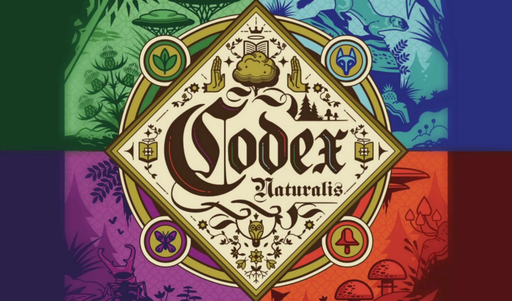

# CodexNaturalis Board Game

  
## Polimi University Project
CodexNaturalis Board Game is the final project for the Software Engineering course of "Engineering of Computing Systems" held at Politecnico di Milano (2023/2024).

## The team
Giaccotto Carmen  
Gherman Denisa  
Franchetti-Rosada Alessia  
Maestrello Lucrezia  

# Implemented Features

| Feature                              |Status|
|--------------------------------------|----- |
| Complete rules                       | ✅   |
| Socket and RMI                       | ✅   |
| Multiple Games                       | ✅   |
| TUI                                  | ✅   |
| GUI                                  |      |
| Persistence                          |      |
| Chat                                 | ❌   |
| Resilience to clients disconnections | ❌   |

