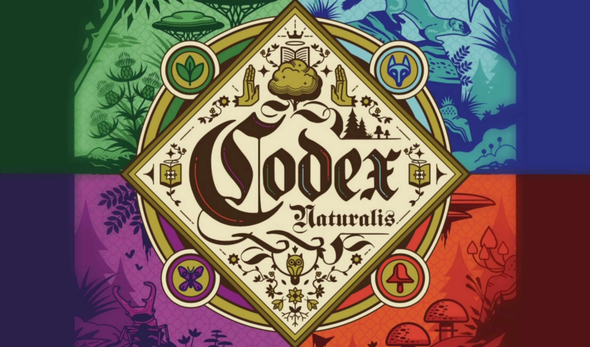

# CodexNaturalis Board Game

  
## Polimi University Project
This is a Java implementation of CodexNaturalis, a board game designed by Thomas Dupont and Maxime Morin, and published by Cranio Creations. This is the final project for the Software Engineering course of "Engineering of Computing Systems" held at Politecnico di Milano (2023/2024).

**Students** <br>

Giaccotto Carmen <br>
Gherman Denisa Minodora <br>
Franchetti-Rosada Alessia <br>
Maestrello Lucrezia <br>

## Implemented Features

| Feature                              |Status|
|--------------------------------------|----- |
| Complete rules                       | ✅   |
| Socket and RMI                       | ✅   |
| TUI                                  | ✅   |
| GUI                                  | ✅   |
| Multiple Games                       | ✅   |
| Persistence                          | ❌   |
| Chat                                 | ❌   |
| Resilience to clients disconnections | ❌   |

## Test cases

| Package  | Class Coverage | Method Coverage | Line Coverage  |
|----------|----------------|-----------------|----------------|
| Model    | 95 % (39/41)   | 90 % (169/186)  | 91 % (551/605) |

## How to run

In the [deliverables/final/jar](deliverables/final/jar) folder there are four executable jar files already compiled.
The application requires an installation of Java 21 or newer.

Because of limitations caused by how JavaFX loads its native libraries, the jar can only support one architecture per Operating System. As such, we have chosen to export the jar with support for the two main OSes we personally use.

**Running on Windows**

- In order to run the server, execute this command:
    ```bash
    java -jar Server.jar
    ```

- To run the client, execute this command:
    ```bash
    java -jar Client.jar
    ```
**Running on macOS**

- In order to run the server, execute this command:
    ```bash
    java -jar macOSClient.jar
    ```

- To run the client, execute this command:
    ```bash
    java -jar macOSServer.jar
    ```
**General Instructions**

In order to play you'll need at least:
- One server
- Two clients <br>
You will be able to choose between the TUI or the GUI interface by typing the option number on your keyboard accordingly.

## More

**Tools and Software Used**

- **[Draw.io](https://www.drawio.com)**: UML and sequence diagrams.
- **[IntelliJ IDEA](https://www.jetbrains.com/idea/)**: Main IDE for project development.
- **[JavaFX](https://openjfx.io/)**: GUI design.
- **[Maven](https://maven.apache.org/)**: Package and dependency management.
- **[SceneBuilder](https://gluonhq.com/products/scene-builder/)**: GUI design.
- **[Overleaf](https://www.overleaf.com/)**: Documentation.

**Credits**

Codex Naturalis is a board game developed and published by Cranio Creations Srl. The graphic content of this project is used with the approval of Cranio Creations Srl for educational purposes only. Distribution, copying, or reproduction of the content and images in any form outside of this project is prohibited, as is the redistribution and publication of the content and images for purposes other than those mentioned above. Additionally, commercial use of said content is prohibited.

