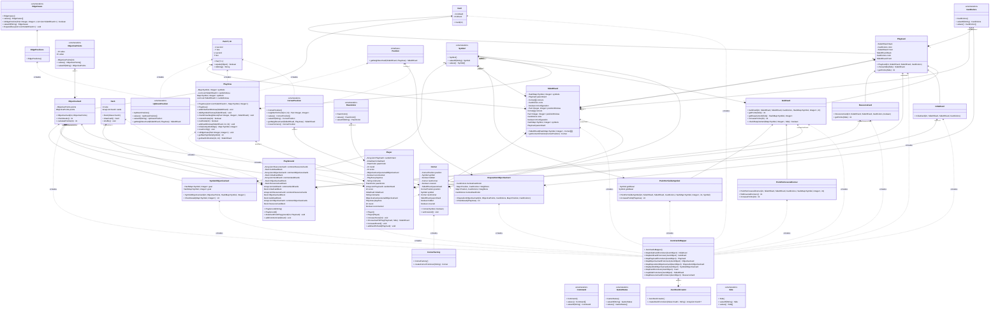

```mermaid
classDiagram
direction BT
class Card {
  + Card(int) 
  - int idCard
   int idCard
}
class CardColors {
<<enumeration>>
  + CardColors() 
  + valueOf(String) CardColors
  + values() CardColors[]
}
class Command {
<<enumeration>>
  + Command() 
  + values() Command[]
  + valueOf(String) Command
}
class Corner {
  + Corner(Symbol, boolean) 
  - CornerPosition position
  - Symbol symbol
  - boolean hidden
  - Corner nextCorner
  - boolean covered
  - SideOfCard parentCard
  + setCovered() void
   CornerPosition position
   Symbol symbol
   Corner nextCorner
   SideOfCard parentCard
   boolean hidden
   boolean covered
}
class CornerFactory {
  + CornerFactory() 
  + createCornerFromJson(String) Corner
}
class CornerPosition {
<<enumeration>>
  + CornerPosition() 
  + neighborToCheck(int, int) Pair~Integer, Integer~
  + values() CornerPosition[]
  + valueOf(String) CornerPosition
  + getNeighbourCard(SideOfCard, PlayArea) SideOfCard
  + CoverCorners() CornerPosition
}
class Deck {
  + Deck(Class~Card~) 
  + drawCard() Card
  + shuffle() void
   int size
   ArrayList~Card~ cards
}
class DispositionObjectiveCard {
  + DispositionObjectiveCard(int, ObjectivePoints, CardColors, Map~Position, CardColors~) 
  - CardColors CentralCardColor
  - Map~Position, CardColors~ Neighbors
  + CheckGoals(PlayArea) int
   Map~Position, CardColors~ Neighbors
   CardColors CentralCardColor
}
class EdgeCases {
<<enumeration>>
  + EdgeCases() 
  + values() EdgeCases[]
  + isEdgePosition(Pair~Integer, Integer~, List~List~SideOfCard~~) boolean
  + valueOf(String) EdgeCases
  + ExpandArea(List~List~SideOfCard~~) void
}
class EdgePositions {
  + EdgePositions() 
}
class GameStatus {
<<enumeration>>
  + GameStatus() 
  + valueOf(String) GameStatus
  + values() GameStatus[]
}
class GoldCard {
  + GoldCard(int, SideOfCard, SideOfCard, CardColors, HashMap~Symbol, Integer~, int) 
  + getPoints(Side) int
  + getRequirement(Side) HashMap~Symbol, Integer~
  + increasePoints(int) int
  + checkRequirement(Map~Symbol, Integer~, Side) boolean
}
class InitialCard {
  + InitialCard(int, SideOfCard, SideOfCard, CardColors) 
}
class JsonCardsMapper {
  + JsonCardsMapper() 
  + MapInitialCardFromJson(JsonObject) InitialCard
  + MapGoldCardFromJson(JsonObject) GoldCard
  + MapPlayCardFromJson(JsonObject) PlayCard
  + MapObjectiveCardFromJson(JsonObject) ObjectiveCard
  + MapDispositionObjectiveCard(JsonObject) DispositionObjectiveCard
  + MapSymbolObjectiveCard(JsonObject) SymbolObjectiveCard
  + MapCardFromJson(JsonObject) Card
  + mapSideFromJson(JsonObject) SideOfCard
  + MapResourceCardFromJson(JsonObject) ResourceCard
}
class JsonDeckCreator {
  + JsonDeckCreator() 
  + createDeckFromJson(Class~Card~, String) ArrayList~Card~?
}
class ObjectiveCard {
  + ObjectiveCard(int, ObjectivePoints) 
  - ObjectivePoints points
  + CheckGoals() int
  + calculatePoints(int) int
   ObjectivePoints points
}
class ObjectivePoints {
<<enumeration>>
  - ObjectivePoints(int) 
  - int value
  + values() ObjectivePoints[]
  + valueOf(String) ObjectivePoints
   int value
}
class Pair~T, U~ {
  + Pair(T, U) 
  - U second
  - T first
  + equals(Object) boolean
  + toString() String
   U second
   T first
}
class PawnColor {
<<enumeration>>
  + PawnColor() 
  + values() PawnColor[]
  + valueOf(String) PawnColor
}
class PlayArea {
  + PlayArea(List~List~SideOfCard~~, Map~Symbol, Integer~) 
  + PlayArea() 
  - Map~Symbol, Integer~ symbols
  - List~List~SideOfCard~~ cardsOnArea
  + addInitialCardOnArea(SideOfCard) void
  + AddSymbolsToArea(SideOfCard) void
  + checkCloseNeighbours(Pair~Integer, Integer~, SideOfCard) void
  + columnExists(int) boolean
  + rowExists(int) boolean
  + addCardOnArea(SideOfCard, int, int) void
  + InitializeSymbolMap() Map~Symbol, Integer~
  + resetConfig() void
  + IsEdgeCase(Pair~Integer, Integer~) void
  + getNumSymbols(Symbol) int
  + getCardInPosition(int, int) SideOfCard
   Map~Symbol, Integer~ symbols
   List~List~SideOfCard~~ cardsOnArea
}
class PlayCard {
  + PlayCard(int, SideOfCard, SideOfCard, CardColors) 
  - SideOfCard Back
  - CardColors color
  - SideOfCard Front
  + chooseSide(Side) SideOfCard
  + getPoints(Side) int
   SideOfCard Back
   CardColors color
   SideOfCard Front
}
class PlayGround {
  + PlayGround(String) 
  + PlayGround() 
  - ArrayList~ResourceCard~ commonResourceCards
  - Deck GoldCardDeck
  - ArrayList~ObjectiveCard~ commonObjectivesCards
  - Deck InitialCardDeck
  - ArrayList~GoldCard~ commonGoldCards
  - Deck ObjectiveCardDeck
  - Deck ResourceCardDeck
  + drawCardFromPlayground(int, PlayCard) void
  + addCommonCard(Card) void
   ArrayList~GoldCard~ commonGoldCards
   Deck InitialCardDeck
   ArrayList~ResourceCard~ commonResourceCards
   Deck ObjectiveCardDeck
   Deck GoldCardDeck
   ArrayList~ObjectiveCard~ commonObjectivesCards
   Deck ResourceCardDeck
}
class Player {
  + Player() 
  + Player(Player) 
  - ArrayList~PlayCard~ cardsInHand
  - InitialCard initialCard
  - PawnColor pawnColor
  - int round
  - int score
  - ObjectiveCard personalObjectiveCard
  - boolean reconnected
  - PlayArea playArea
  - String nickname
  + increaseScore(int) void
  + ChooseCardToPlay(PlayCard, Side) SideOfCard
  + IncreaseRound() void
  + addCardToHand(PlayCard) void
   PawnColor pawnColor
   ArrayList~PlayCard~ cardsInHand
   int score
   InitialCard initialCard
   String nickname
   ObjectiveCard personalObjectiveCard
   PlayArea playArea
   int round
   boolean reconnected
}
class PointPerCoveredCorner {
  + PointPerCoveredCorner(int, SideOfCard, SideOfCard, CardColors, HashMap~Symbol, Integer~, int) 
  + findCoveredCorners() int
  + increasePoints(int) int
}
class PointPerVisibleSymbol {
  + PointPerVisibleSymbol(int, SideOfCard, SideOfCard, CardColors, HashMap~Symbol, Integer~, int, Symbol) 
  - Symbol goldGoal
  + increasePoints(PlayArea) int
   Symbol goldGoal
}
class Position {
<<Interface>>
  + getNeighbourCard(SideOfCard, PlayArea) SideOfCard
}
class ResourceCard {
  + ResourceCard(int, SideOfCard, SideOfCard, CardColors, boolean) 
  + getPoints(Side) int
}
class Side {
<<enumeration>>
  + Side() 
  + valueOf(String) Side
  + values() Side[]
}
class SideOfCard {
  + SideOfCard(HashMap~Symbol, Integer~, Corner[][]) 
  - HashMap~Symbol, Integer~ symbols
  - PlayCard parentCard
  - Corner[][] corners
  - CardColors color
  - boolean InConfiguration
  - Pair~Integer, Integer~ positionOnArea
  + getCornerInPosition(CornerPosition) Corner
   Corner[][] corners
   Pair~Integer, Integer~ positionOnArea
   CardColors color
   boolean InConfiguration
   HashMap~Symbol, Integer~ symbols
   PlayCard parentCard
}
class Symbol {
<<enumeration>>
  + Symbol() 
  + valueOf(String) Symbol
  + values() Symbol[]
}
class SymbolObjectiveCard {
  + SymbolObjectiveCard(int, ObjectivePoints, HashMap~Symbol, Integer~) 
  - HashMap~Symbol, Integer~ goal
  + CheckGoals(Map~Symbol, Integer~) int
   HashMap~Symbol, Integer~ goal
}
class UpDownPosition {
<<enumeration>>
  + UpDownPosition() 
  + values() UpDownPosition[]
  + valueOf(String) UpDownPosition
  + getNeighbourCard(SideOfCard, PlayArea) SideOfCard
}

Corner "1" *--> "position 1" CornerPosition 
Corner "1" *--> "parentCard 1" SideOfCard 
Corner "1" *--> "symbol 1" Symbol 
CornerFactory  ..>  Corner : «create»
CornerPosition  ..>  Pair~T, U~ : «create»
CornerPosition  ..>  Position 
DispositionObjectiveCard "1" *--> "Neighbors *" CardColors 
DispositionObjectiveCard  -->  ObjectiveCard 
DispositionObjectiveCard "1" *--> "Neighbors *" Position 
EdgePositions  -->  EdgeCases 
GoldCard  -->  PlayCard 
GoldCard "1" *--> "requirement *" Symbol 
InitialCard  -->  PlayCard 
JsonCardsMapper  ..>  Card : «create»
JsonCardsMapper  ..>  Corner : «create»
JsonCardsMapper  ..>  DispositionObjectiveCard : «create»
JsonCardsMapper  ..>  GoldCard : «create»
JsonCardsMapper  ..>  InitialCard : «create»
JsonCardsMapper  ..>  ObjectiveCard : «create»
JsonCardsMapper  ..>  PlayCard : «create»
JsonCardsMapper  ..>  PointPerCoveredCorner : «create»
JsonCardsMapper  ..>  PointPerVisibleSymbol : «create»
JsonCardsMapper  ..>  ResourceCard : «create»
JsonCardsMapper  ..>  SideOfCard : «create»
JsonCardsMapper  ..>  SymbolObjectiveCard : «create»
JsonDeckCreator "1" *--> "mapper 1" JsonCardsMapper 
ObjectiveCard  -->  Card 
ObjectiveCard "1" *--> "points 1" ObjectivePoints 
PlayArea  ..>  EdgePositions : «create»
PlayArea  ..>  Pair~T, U~ : «create»
PlayArea "1" *--> "symbols *" Symbol 
PlayCard  -->  Card 
PlayCard "1" *--> "color 1" CardColors 
PlayCard "1" *--> "Front 1" SideOfCard 
PlayGround  ..>  Deck : «create»
PlayGround "1" *--> "GoldCardDeck 1" Deck 
PlayGround "1" *--> "commonGoldCards *" GoldCard 
PlayGround "1" *--> "commonObjectivesCards *" ObjectiveCard 
PlayGround "1" *--> "commonResourceCards *" ResourceCard 
Player "1" *--> "initialCard 1" InitialCard 
Player "1" *--> "personalObjectiveCard 1" ObjectiveCard 
Player "1" *--> "pawnColor 1" PawnColor 
Player "1" *--> "playArea 1" PlayArea 
Player  ..>  PlayArea : «create»
Player "1" *--> "cardsInHand *" PlayCard 
PointPerCoveredCorner  -->  GoldCard 
PointPerVisibleSymbol  -->  GoldCard 
PointPerVisibleSymbol "1" *--> "goldGoal 1" Symbol 
ResourceCard  -->  PlayCard 
SideOfCard "1" *--> "color 1" CardColors 
SideOfCard "1" *--> "corners *" Corner 
SideOfCard "1" *--> "positionOnArea 1" Pair~T, U~ 
SideOfCard "1" *--> "parentCard 1" PlayCard 
SideOfCard "1" *--> "symbols *" Symbol 
SymbolObjectiveCard  -->  ObjectiveCard 
SymbolObjectiveCard "1" *--> "goal *" Symbol 
UpDownPosition  ..>  Pair~T, U~ : «create»
UpDownPosition  ..>  Position 
```
