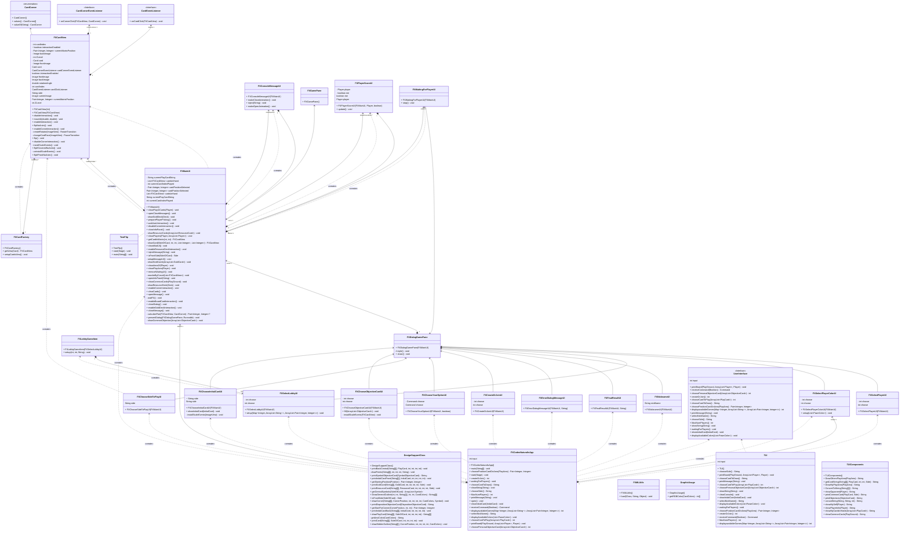

```mermaid
classDiagram
direction BT
class CardCorner {
<<enumeration>>
  + CardCorner() 
  + values() CardCorner[]
  + valueOf(String) CardCorner
}
class CardCornerEventListener {
<<Interface>>
  + onCornerClick(FXCardView, CardCorner) void
}
class CardEventListener {
<<Interface>>
  + onCardClick(FXCardView) void
}
class DesignSupportClass {
  + DesignSupportClass() 
  + printBackCentral(String[][], PlayCard, int, int, int, int) void
  - drawPoints(String[][], int, int, int, String) void
  + printSymbolObjectiveCard(SymbolObjectiveCard) String
  + printInitialCardFront(String[][], InitialCard, int, int, int, int) void
  + getStartingPosition(Position) Pair~Integer, Integer~
  + printGoldCard(String[][], GoldCard, int, int, int, int, Side) void
  + printResourceCard(String[][], ResourceCard, int, int, int, int, Side) void
  + getCentralSymbols(SideOfCard) ArrayList~Symbol~
  + DrawGeneralOutline(int, int, String[][], int, int, CardColors) String[][]
  + isFrontSide(SideOfCard) Side
  + drawCorner(String[][], CornerPosition, int, int, int, int, CardColors, Symbol) void
  + printDispositionObjectiveCard(DispositionObjectiveCard) String
  + getStartForCorner(CornerPosition, int, int) Pair~Integer, Integer~
  + printInitialCardBack(String[][], InitialCard, int, int, int, int) void
  + drawPlayCard(String[][], SideOfCard, int, int, int, int) String[][]
  - getAnsiColor(CardColors) String
  + printCard(String[][], SideOfCard, int, int, int, int) void
  + drawHiddenOutline(String[][], CornerPosition, int, int, int, int, CardColors) void
}
class FXCardFactory {
  + FXCardFactory() 
  + getView(Card) FXCardView
  + setupCardsView() void
}
class FXCardView {
  + FXCardView(int) 
  + FXCardView(FXCardView) 
  - int cardIndex
  ~ boolean interactionEnabled
  - Pair~Integer, Integer~ currentMatrixPosition
  - Image backImage
  - int ZLevel
  - Card card
  - Image frontImage
  + disableInteraction() void
  + moveAt(double, double) void
  + enableInteraction() void
  + flipNoAnim() void
  + enableCornerInteraction() void
  - createRotator(ImageView) RotateTransition
  - changeCardFace(ImageView) PauseTransition
  + flip() void
  + disableCornerInteraction() void
  - installScaleEvents() void
  + flipIfCoveredNoAnim() void
  - uninstallScaleEvents() void
  + flipIfFrontNoAnim() void
   Card card
   CardCornerEventListener cardCornerEventListener
   boolean interactionEnabled
   Image frontImage
   Image backImage
   double rotationAngle
   int cardIndex
   CardEventListener cardClickListener
   String side
   Image currentImage
   Pair~Integer, Integer~ currentMatrixPosition
   int ZLevel
}
class FXChooseInitialCardUI {
  + FXChooseInitialCardUI(FXMainUI) 
  ~ String side
  + showInitialCard(InitialCard) void
  - installScaleEvents(ImageView) void
   String side
}
class FXChooseObjectiveCardUI {
  + FXChooseObjectiveCardUI(FXMainUI) 
  - int choose
  + fill(ArrayList~ObjectiveCard~) void
  - installScaleEvents(FXCardView) void
   int choose
}
class FXChooseSideToPlayUI {
  + FXChooseSideToPlayUI(FXMainUI) 
   String side
}
class FXChooseYourOptionUI {
  + FXChooseYourOptionUI(FXMainUI, boolean) 
  - Command choose
   Command choose
}
class FXCodexNaturalisApp {
  + FXCodexNaturalisApp() 
  + main(String[]) void
  + choosePositionCardOnArea(PlayArea) Pair~Integer, Integer~
  + start(Stage) void
  + createOrJoin() int
  + waitingForPlayers() void
  + chooseCardToDraw() String
  + showString(String) void
  + chooseSide() String
  + MaxNumPlayers() int
  + printMessage(String) void
  + open() void
  + showInitialCard(InitialCard) void
  + receiveCommand(Boolean) Command
  + displayavailableGames(Map~Integer, ArrayList~String~~, ArrayList~Pair~Integer, Integer~~) int
  + selectNickName() String
  + displayAvailableColors(List~PawnColor~) void
  + chooseCardToPlay(ArrayList~PlayCard~) int
  + printBoard(PlayGround, ArrayList~Player~, Player) void
  + choosePersonaObjectiveCard(ArrayList~ObjectiveCard~) int
   int input
}
class FXConsoleMessageUI {
  + FXConsoleMessageUI(FXMainUI) 
  + makeCloseAnimation() void
  + inject(String) void
  + makeOpenAnimation() void
}
class FXCreateOrJoinUI {
  + FXCreateOrJoinUI(FXMainUI) 
  - int choose
   int choose
}
class FXDialogGamePane {
  + FXDialogGamePane(FXMainUI) 
  # style() void
  + close() void
}
class FXErrorDialogMessageUI {
  + FXErrorDialogMessageUI(FXMainUI, String) 
}
class FXFinalResultUI {
  + FXFinalResultUI(FXMainUI, String) 
}
class FXGamePane {
  + FXGamePane() 
}
class FXLobbyGameItem {
  + FXLobbyGameItem(FXSelectLobbyUI) 
  + setup(int, int, String) void
}
class FXMLUtils {
  + FXMLUtils() 
  + load(Class, String, Object) void
}
class FXMainUI {
  + FXMainUI() 
  - String currentPlayCardString
  - List~FXCardView~ cardsInHand
  - int currentCardIndexPlayed
  - Pair~Integer, Integer~ cardPositionSelected
  + showPlayerCards(Player) void
  + openCloseMessages() void
  - showGoldDeck(Deck) void
  + preparePlayerPicking() void
  + waitUserInteraction() void
  + disableCornerInteraction() void
  + closeInfoPanel() void
  - showResourceCards(ArrayList~ResourceCard~) void
  + showPlayers(Player, ArrayList~Player~) void
  + getCardInMatrix(int, int) FXCardView
  - showCard(SideOfCard, int, int, List~Integer~, List~Integer~) FXCardView
  + showWaitUI() void
  + enableResourceDeckInteraction() void
  + injectMessage(String) void
  + isFrontSide(SideOfCard) Side
  - setupMessageUI() void
  - showGoldCards(ArrayList~GoldCard~) void
  + showAreaOf(Player) void
  + showPlayArea(Player) void
  + removeWaitingUI() void
  - reorderByZLevel(List~FXCardView~) void
  + openInfoPanel(String) void
  + showCommonCards(PlayGround) void
  - showResourceDeck(Deck) void
  + enableCornerInteraction() void
  + clearCards() void
  + openMessage() void
  - waitFX() void
  + enableBoardCardInteraction() void
  + closeDialog() void
  + enableGoldDeckInteraction() void
  + closeMessage() void
  - calculatePair(FXCardView, CardCorner) Pair~Integer, Integer~?
  + presentDialog(FXDialogGamePane, Runnable) void
  - showCommonObjective(ArrayList~ObjectiveCard~) void
   Pair~Integer, Integer~ cardPositionSelected
   List~FXCardView~ cardsInHand
   String currentPlayCardString
   int currentCardIndexPlayed
}
class FXNicknameUI {
  + FXNicknameUI(FXMainUI) 
   String nickName
}
class FXPlayerScoreUI {
  + FXPlayerScoreUI(FXMainUI, Player, boolean) 
  - Player player
  - boolean me
  + update() void
   boolean me
   Player player
}
class FXSelectLobbyUI {
  + FXSelectLobbyUI(FXMainUI) 
  - int choose
  + setup(Map~Integer, ArrayList~String~~, ArrayList~Pair~Integer, Integer~~) void
   int choose
}
class FXSelectPlayerColorUI {
  + FXSelectPlayerColorUI(FXMainUI) 
  - int choose
  + setup(List~PawnColor~) void
   int choose
}
class FXSelectPlayerUI {
  + FXSelectPlayerUI(FXMainUI) 
  - int choose
   int choose
}
class FXWaitingForPlayerUI {
  + FXWaitingForPlayerUI(FXMainUI) 
  + stop() void
}
class GraphicUsage {
  + GraphicUsage() 
  + getRGBColor(CardColors) int[]
}
class TUI {
  + TUI() 
  + chooseSide() String
  + printBoard(PlayGround, ArrayList~Player~, Player) void
  + chooseCardToDraw() String
  + printMessage(String) void
  + chooseCardToPlay(ArrayList~PlayCard~) int
  + choosePersonaObjectiveCard(ArrayList~ObjectiveCard~) int
  + showString(String) void
  + clearConsole() void
  + showInitialCard(InitialCard) void
  + selectNickName() String
  + displayAvailableColors(List~PawnColor~) void
  + waitingForPlayers() void
  + choosePositionCardOnArea(PlayArea) Pair~Integer, Integer~
  + createOrJoin() int
  + receiveCommand(Boolean) Command
  + MaxNumPlayers() int
  + displayavailableGames(Map~Integer, ArrayList~String~~, ArrayList~Pair~Integer, Integer~~) int
   int input
}
class TUIComponents {
  + TUIComponents() 
  + DrawOthersPlayArea(PlayArea) String
  + getCardString(String[][], PlayCard, int, int, Side) String
  + DrawMyPlayArea(PlayArea) String
  + ConvertToString(String[][]) String
  + showOpponent(Player) String
  + printCommonCard(PlayCard, Side) String
  + printObjectives(ObjectiveCard) String
  + concatString(String, String, int) String
  + showMySelf(Player) String
  + showPlayerInfo(Player) String
  + showMyCardsInHand(ArrayList~PlayCard~) String
  + showCommonCards(PlayGround) String
}
class TestFlip {
  + TestFlip() 
  + start(Stage) void
  + main(String[]) void
}
class UserInterface {
<<Interface>>
  + printBoard(PlayGround, ArrayList~Player~, Player) void
  + receiveCommand(Boolean) Command
  + choosePersonaObjectiveCard(ArrayList~ObjectiveCard~) int
  + createOrJoin() int
  + chooseCardToPlay(ArrayList~PlayCard~) int
  + chooseCardToDraw() String
  + choosePositionCardOnArea(PlayArea) Pair~Integer, Integer~
  + displayavailableGames(Map~Integer, ArrayList~String~~, ArrayList~Pair~Integer, Integer~~) int
  + printMessage(String) void
  + selectNickName() String
  + chooseSide() String
  + MaxNumPlayers() int
  + showString(String) void
  + waitingForPlayers() void
  + showInitialCard(InitialCard) void
  + displayAvailableColors(List~PawnColor~) void
   int input
}

FXCardView  -->  CardCorner 
FXCardFactory  ..>  FXCardView : «create»
FXCardFactory "1" *--> "cardViews *" FXCardView 
FXCardView "1" *--> "cornerListener 1" CardCornerEventListener 
FXCardView "1" *--> "listener 1" CardEventListener 
FXChooseInitialCardUI  -->  FXDialogGamePane 
FXChooseObjectiveCardUI  -->  FXDialogGamePane 
FXChooseSideToPlayUI  ..>  FXCardView : «create»
FXChooseSideToPlayUI  -->  FXDialogGamePane 
FXChooseYourOptionUI  -->  FXDialogGamePane 
FXCodexNaturalisApp  ..>  FXChooseInitialCardUI : «create»
FXCodexNaturalisApp  ..>  FXChooseObjectiveCardUI : «create»
FXCodexNaturalisApp  ..>  FXChooseSideToPlayUI : «create»
FXCodexNaturalisApp  ..>  FXChooseYourOptionUI : «create»
FXCodexNaturalisApp  ..>  FXCreateOrJoinUI : «create»
FXCodexNaturalisApp  ..>  FXErrorDialogMessageUI : «create»
FXCodexNaturalisApp  ..>  FXFinalResultUI : «create»
FXCodexNaturalisApp  ..>  FXMainUI : «create»
FXCodexNaturalisApp "1" *--> "mainUI 1" FXMainUI 
FXCodexNaturalisApp  ..>  FXNicknameUI : «create»
FXCodexNaturalisApp  ..>  FXSelectLobbyUI : «create»
FXCodexNaturalisApp  ..>  FXSelectPlayerColorUI : «create»
FXCodexNaturalisApp "1" *--> "colorUI 1" FXSelectPlayerColorUI 
FXCodexNaturalisApp  ..>  FXSelectPlayerUI : «create»
FXCodexNaturalisApp  ..>  UserInterface 
FXConsoleMessageUI "1" *--> "owner 1" FXMainUI 
FXCreateOrJoinUI  -->  FXDialogGamePane 
FXDialogGamePane "1" *--> "owner 1" FXMainUI 
FXErrorDialogMessageUI  -->  FXDialogGamePane 
FXFinalResultUI  -->  FXDialogGamePane 
FXLobbyGameItem "1" *--> "owner 1" FXSelectLobbyUI 
FXMainUI  ..>  FXCardView : «create»
FXMainUI "1" *--> "cardsOnTable *" FXCardView 
FXMainUI "1" *--> "messageUI 1" FXConsoleMessageUI 
FXMainUI  ..>  FXConsoleMessageUI : «create»
FXMainUI  -->  FXGamePane 
FXMainUI "1" *--> "playerScoreItems *" FXPlayerScoreUI 
FXMainUI  ..>  FXPlayerScoreUI : «create»
FXMainUI "1" *--> "waitUI 1" FXWaitingForPlayerUI 
FXMainUI  ..>  FXWaitingForPlayerUI : «create»
FXNicknameUI  -->  FXDialogGamePane 
FXPlayerScoreUI "1" *--> "mainUI 1" FXMainUI 
FXSelectLobbyUI  -->  FXDialogGamePane 
FXSelectLobbyUI  ..>  FXLobbyGameItem : «create»
FXSelectPlayerColorUI  -->  FXDialogGamePane 
FXSelectPlayerUI  -->  FXDialogGamePane 
FXWaitingForPlayerUI  -->  FXDialogGamePane 
TUI  ..>  UserInterface 
TestFlip  ..>  FXCardView : «create»
```